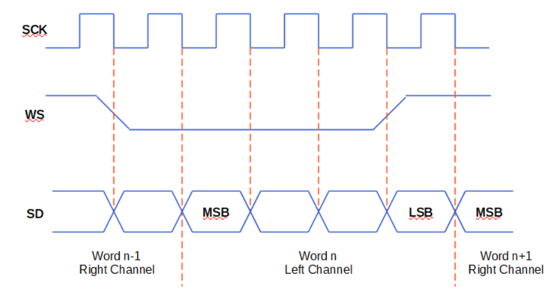

# Pràctica 7: Busos de comunicació III (I2S)
L'objectiu d'aquesta pràctica és entendre la utilitat i funcionament del bus I2S ("Inter-Intergrated Circuit Sound"). 

Aquest tipus de bus s'utilitza per conectar dispositius d'audio digital. Això és així, ja que permet enviar senyals stereo de tipus PCM ("pulse code modulation"). 

Aquests són senyals on l'audio es troba mostrejat a una certa freqüencia de mostreig, i el valor de cada mostra es troba modulat en forma de codi (bits). La tecnologia I2S permet transmetre senyals amb mostres de 4 a 32 bits.

El funcionament d'aquest tipus de bus es basa en una conexió sincrona entre dispositius que consta de 3 canals:

* SCK (o BCLK): canal pel qual es transmet la senyal de rellotge que permet sincronitzar la comunicació.

* WS ("Word Select" o "Frame Select"): Es tracta del canal pel qual el transmisor indica si envia dades del canal d'audio esquerra, o del canal d'audio dret (pren valor "0" per l'esquerra, i "1" pel dret).

* SD ("Serial Data"): canal pel qual s'enviarà el senyal d'ambdós canals d'audio (esquerra i dret). 

Exemple de comunicació I2S per passos:

1. El transmissor escriu valor "0" al canal WS. Aquest fet informa al receptor de que se li enviarà una mostra del canal d'audio esquerra.
2. El transmissor espera un cicle de rellotge i posteriorment comença a enviar els bits de la mostra pel canal SD.
3. Abans de transmetre l'ultim bit, el transmissor canvia el valor que escriu pel canal WS de "0" a "1". Aquest fet informa al receptor de que el próxim bit formarà part d'una mostra diferent (en aquest cas serà la primera mostra del canal dret). 
4. Es repeteix el procés fins que ja no hi ha més mostres a enviar.



Al tractar-se d'una conexió sincrona, la senyal de rellotge continuarà emetent per poder realitzar una possible nova transmisió.
___
## CODI DE LA PRÀCTICA
```
#include <Arduino.h>
#include <AudioGeneratorAAC.h>
#include <AudioOutputI2S.h>
#include <AudioFileSourcePROGMEM.h>
#include <sampleaac.h>

AudioFileSourcePROGMEM *in;
AudioGeneratorAAC *aac;
AudioOutputI2S *out;

void setup(){
  Serial.begin(115200);
  in = new AudioFileSourcePROGMEM(sampleaac, sizeof(sampleaac));
  aac = new AudioGeneratorAAC();
  out = new AudioOutputI2S();
  out -> SetGain(0.125);
  out -> SetPinout(26,25,22);
  aac->begin(in, out);
}

void loop(){
  if (aac->isRunning()) {
    aac->loop();
    } else {

      aac -> stop();
      Serial.printf("Sound Generator\n");
      delay(1000);
  }
}
```
S'utilitzen diversos objectes que pertanyen a la llibreria "ESP8266Audio" (els 3 include anomenats "Audio... .h").

La llibreria "AudioOutputI2S.h" és la que gestiona el bus I2S.

"sampleaac.h" serà el fitxer d'audio que reproduirà el codi. 


